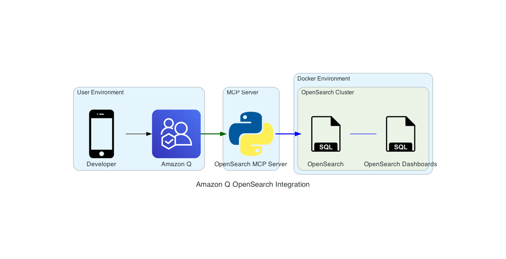

# Architecture Overview

The integration between Amazon Q and OpenSearch involves a streamlined architecture that enables natural language interaction with OpenSearch through the MCP server.

## Architecture Diagram

## Components

### User Environment
- **Developer**: The end user interacting with the system
- **Amazon Q**: AWS's AI-powered assistant integrated into the IDE, processing natural language queries

### MCP Server
- **OpenSearch MCP Server**: Core component that translates natural language queries into OpenSearch operations

### Docker Environment
#### OpenSearch Cluster
- **OpenSearch**: The main search and analytics engine
- **OpenSearch Dashboards**: Web UI for visualizing and managing OpenSearch data

## Connection Flow

1. **User Interaction**
   - Developer inputs natural language queries to Amazon Q
   - Amazon Q processes and understands the intent of the query

2. **MCP Server Processing**
   - Queries are routed to the OpenSearch MCP server
   - Natural language is translated into specific OpenSearch operations
   - Results are formatted for user consumption

3. **OpenSearch Integration**
   - OpenSearch MCP server communicates directly with the OpenSearch cluster
   - Results are returned through Amazon Q to the user
   - OpenSearch Dashboards provides additional visualization capabilities

## Security

- Secure communication between all components
- Authentication required for OpenSearch access
- Docker environment isolated with defined network boundaries

## Data Flow

1. **Query Flow**
   - User → Amazon Q → OpenSearch MCP Server → OpenSearch

2. **Response Flow**
   - OpenSearch → OpenSearch MCP Server → Amazon Q → User

3. **Management Flow**
   - User → OpenSearch Dashboards → OpenSearch