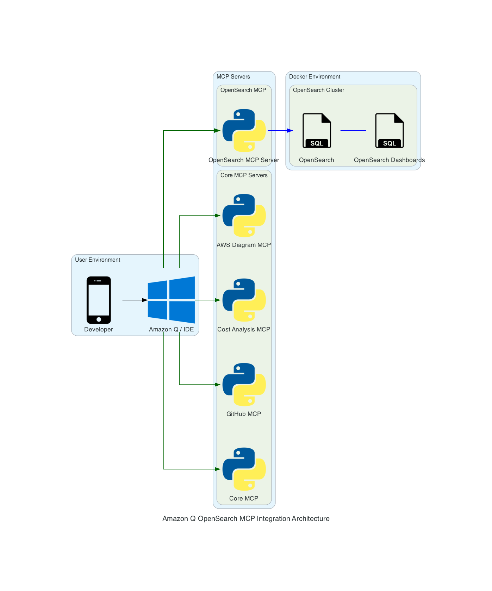

# Architecture Overview

The integration between Amazon Q, MCP servers, and OpenSearch involves several components working together to provide natural language interaction with OpenSearch.

## Architecture Diagram

## Components

### User Environment
- **Developer**: The end user interacting with the system
- **Amazon Q / IDE**: The IDE with Amazon Q integration where users input natural language queries

### MCP Servers
#### Core MCP Servers
- **Core MCP**: Handles core MCP protocol functionality
- **GitHub MCP**: Provides GitHub integration capabilities
- **Cost Analysis MCP**: Analyzes AWS service costs
- **AWS Diagram MCP**: Generates AWS architecture diagrams

#### OpenSearch MCP
- **OpenSearch MCP Server**: Translates natural language queries into OpenSearch operations

### Docker Environment
#### OpenSearch Cluster
- **OpenSearch**: The main search and analytics engine
- **OpenSearch Dashboards**: Web UI for visualizing and managing OpenSearch data

## Connection Flow

1. **User Interaction**
   - Developer interacts with Amazon Q in their IDE
   - Natural language queries are processed by Amazon Q

2. **MCP Server Processing**
   - Queries are routed to appropriate MCP servers
   - OpenSearch MCP server translates natural language to OpenSearch operations
   - Other MCP servers handle their specific domains (GitHub, Cost Analysis, etc.)

3. **OpenSearch Integration**
   - OpenSearch MCP server communicates with OpenSearch cluster
   - Results are returned through Amazon Q to the user
   - OpenSearch Dashboards provides direct visualization capabilities

## Security

- All communications use secure protocols
- Authentication is required for OpenSearch access
- MCP servers run with specific security contexts
- Docker environment is isolated with defined network boundaries

## Data Flow

1. **Input Flow**
   - User → Amazon Q → MCP Servers → OpenSearch

2. **Output Flow**
   - OpenSearch → MCP Servers → Amazon Q → User

3. **Management Flow**
   - User → OpenSearch Dashboards → OpenSearch